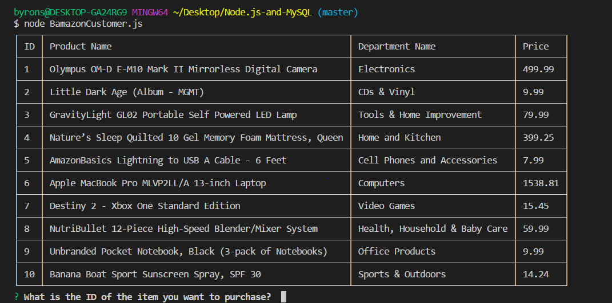
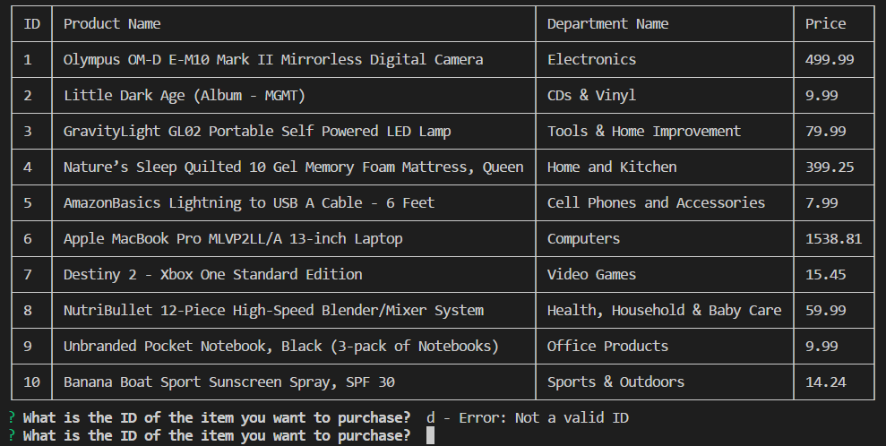
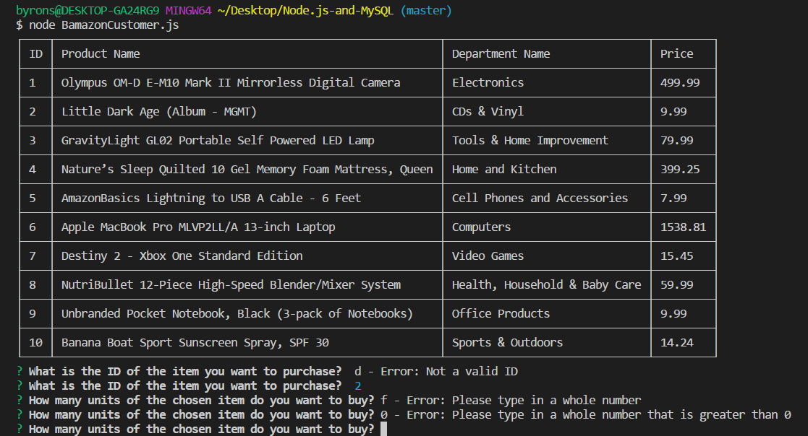
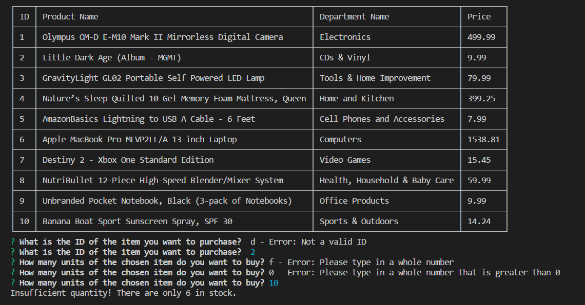
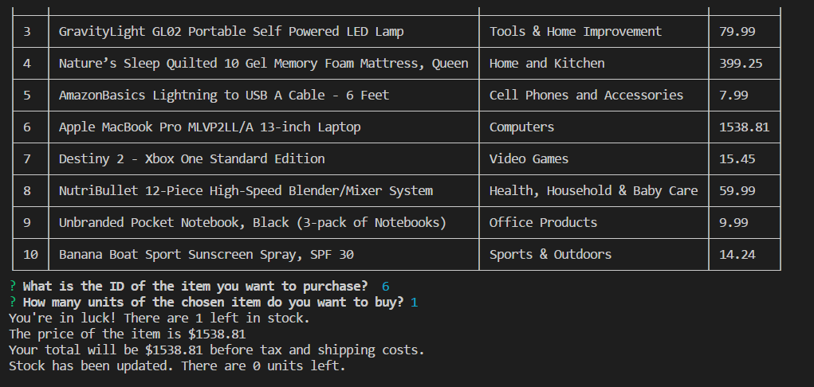

# Node.js-and-MySQL

## Overview
Bamazon is a CLI App that is designed to mimic an Amazon-like storefront. Using MySQL and Javascript, the app takes in order from the customer and depletes stock from the store's inventory.

## Bamazon Customer
When one types in node bamazonCustomer.js into the command line, a table will pop up with 10 different items. The customer will then be asked what the id of the item they want to purchase is.

Once prompted, the customer must type in a value between 1 and 10. If the customer does not type in a valid id, an error will pop up and the customer will be asked again.

Once the customer types in a valid id, the customer will be asked how many units of the chosen item they want to purchase. The value they must type must be a whole number greater than 0. If the customer does not type in a valid number, an error will pop up and they will be prompted again with the same question.

After the customer asks for a certain number of units to purchase, the command line will either tell the customer one of two things. If there are not enough items in storage, the command line will spit out a message that there are not enough items in storage.

However, if there are enough units in stock, the customer will be told the total cost of their purchase and stock number will be updated to account for their purchase.

